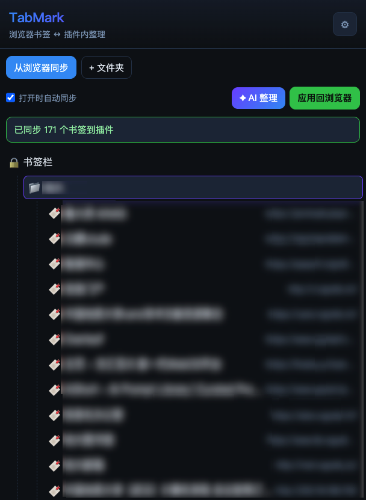
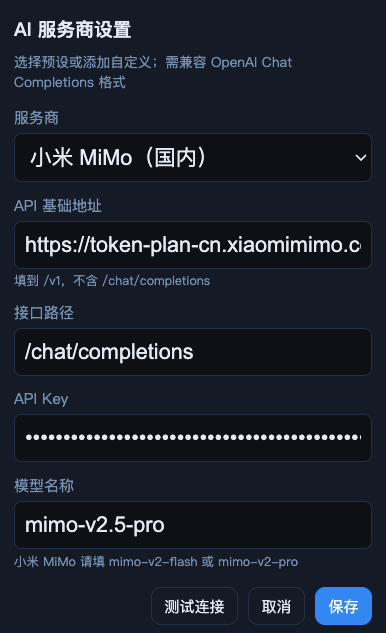
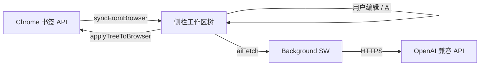

# TabMark · AI 浏览器书签整理

<p align="center">
  <strong>把 Chrome 书签同步到侧栏编辑，AI 智能归类命名，一键写回浏览器</strong>
</p>

<p align="center">
  <a href="https://github.com/Jenrimark/tabmark-organizer"></a>
  <a href="LICENSE"></a>
  
  
  
</p>

<p align="center">
  <a href="#-功能特性">功能</a> ·
  <a href="#-快速开始">安装</a> ·
  <a href="#-使用指南">使用</a> ·
  <a href="#-ai-配置">AI 配置</a> ·
  <a href="#-项目结构">结构</a> ·
  <a href="#-常见问题">FAQ</a> ·
  <a href="#-开源协议">协议</a>
</p>

---

## 📖 简介

**TabMark** 是一款基于 **Chrome Manifest V3** 的浏览器扩展，专注于**书签的同步、可视化整理与 AI 辅助优化**。

与「采集标签页」类工具不同，TabMark 的核心路径是：

```text
Chrome 书签  ──从浏览器同步──►  插件侧栏编辑  ──应用回浏览器──►  书签栏更新
```

你可以在侧栏中拖拽排序、重命名、新建文件夹，调用任意 **OpenAI 兼容** 的大模型 API 自动优化书签名称与目录结构，再安全写回 Chrome 原书签位置（保留每条书签的 `chromeId`）。

> **English (brief):** TabMark is a Chromium extension that syncs your browser bookmarks into a side panel for drag-and-drop editing, optional LLM-powered reorganization, and safe write-back to Chrome bookmarks.

---

## ✨ 功能特性

| 功能 | 说明 |
|------|------|
| 🔄 **双向书签同步** | 从浏览器拉取完整书签树（书签栏、其他书签等），写回时按 ID 原位更新 |
| 🌲 **树形可视化编辑** | 拖拽排序、重命名、新建子文件夹（不增删书签） |
| 🔢 **书签数量锁定** | 同步时记录基准条数，应用前强制校验，禁止增删书签 |
| 🔒 **系统目录保护** | 自动识别「书签栏 / 其他书签」等系统根目录，禁止误改导致 API 报错 |
| ✦ **AI 智能整理** | 调用 OpenAI 兼容 API，自动建议文件夹结构与中文友好命名 |
| ⚙️ **多服务商支持** | 内置 OpenAI、DeepSeek、通义、智谱、小米 MiMo 等预设，支持自定义 API |
| 🧪 **连接测试** | 保存前可测试 API 是否可用 |
| 💾 **工作区缓存** | 本地暂存编辑状态；可选「打开侧栏时自动同步」 |

---

## 🖼️ 界面预览

> 在侧栏中打开 TabMark 即可使用（Chrome 114+ 支持 Side Panel）。

<p align="center">
  
</p>

---

## 🚀 快速开始

### 环境要求

- **Google Chrome** 114+（或基于 Chromium 的 **Microsoft Edge**、Brave 等）
- 若使用 AI 功能：可访问的 **OpenAI 兼容 API** 及有效 **API Key**

### 从源码安装（开发者模式）

1. 克隆仓库：

   ```bash
   git clone https://github.com/Jenrimark/tabmark-organizer.git
   cd tabmark-organizer
   ```

2. 打开浏览器扩展管理页：
   - Chrome：`chrome://extensions/`
   - Edge：`edge://extensions/`

3. 开启右上角 **开发者模式**

4. 点击 **加载已解压的扩展程序**，选择本项目根目录（包含 `manifest.json` 的文件夹）

5. 点击工具栏中的 TabMark 图标，选择 **在侧栏中打开**

### 更新扩展

修改代码后，在 `chrome://extensions/` 页面点击 TabMark 卡片上的 **刷新** 按钮重新加载。

---

## 📚 使用指南

### 基本流程

1. **从浏览器同步** — 拉取当前 Chrome 全部书签到插件（保留 `chromeId`）
2. **手动整理** — 拖拽调整层级、重命名、增删节点
3. **（可选）✦ AI 整理** — 由大模型生成更清晰的目录与标题
4. **应用回浏览器** — 将修改写回 Chrome 书签

### 按钮说明

| 按钮 | 作用 |
|------|------|
| **从浏览器同步** | 重新从 Chrome 读取书签（会覆盖侧栏未写回的编辑，操作前会确认） |
| **+ 文件夹** | 在列表顶部新建文件夹 |
| **✦ AI 整理** | 调用已配置的 AI API 优化结构 |
| **应用回浏览器** | 将侧栏中的树写回 Chrome |
| **⚙ 设置** | 配置 AI 服务商、API Key、模型等 |

### 书签数量一致性（核心原则）

整理过程**只改名字、位置、文件夹分类**，**绝不改变书签条数**：

| 允许 | 禁止 |
|------|------|
| 重命名书签标题 | 删除书签 |
| 拖拽调整顺序与层级 | 新增书签 |
| 新建/重命名子文件夹 | 写回时从浏览器删除条目 |
| AI 自动分类与命名 | AI 合并或省略任何 URL |

- 从浏览器同步时会**锁定书签基准数量**
- 应用回浏览器前会**校验条数**，不一致则拒绝写入
- AI 若遗漏书签，会自动放入 **「未归类（自动保留）」** 文件夹

### ⚠️ 使用注意

- 带 **🔒** 的节点为 Chrome **系统根目录**（书签栏、其他书签等），**不可改名或拖拽**，请只整理其**内部**子项。
- AI 整理后建议先检查结构，再点「应用回浏览器」。
- 建议先 **从浏览器同步** 再 AI 整理，避免 ID 映射错乱。

---

## 🤖 AI 配置

侧栏点击 **⚙** → 选择服务商 → 填写 **API Key** → **测试连接** → **保存**。

<p align="center">
  
</p>

### 内置服务商预设

| 服务商 | API 基础地址 | 默认模型 |
|--------|----------------|----------|
| OpenAI | `https://api.openai.com/v1` | `gpt-4o-mini` |
| DeepSeek | `https://api.deepseek.com/v1` | `deepseek-chat` |
| Moonshot (Kimi) | `https://api.moonshot.cn/v1` | `moonshot-v1-8k` |
| 通义千问 | `https://dashscope.aliyuncs.com/compatible-mode/v1` | `qwen-plus` |
| 智谱 AI | `https://open.bigmodel.cn/api/paas/v4` | `glm-4-flash` |
| SiliconFlow | `https://api.siliconflow.cn/v1` | `deepseek-ai/DeepSeek-V3` |
| 小米 MiMo（国内） | `https://token-plan-cn.xiaomimimo.com/v1` | `mimo-v2-flash` |
| 小米 MiMo（国际） | `https://api.xiaomimimo.com/v1` | `mimo-v2-flash` |

### 自定义服务商

1. 在下拉框选择 **「+ 新建自定义…」**
2. 填写 **API 基础地址**（填到 `/v1`，不含 `/chat/completions`）
3. 填写 **接口路径**（默认 `/chat/completions`）
4. 填写 **模型名称** 与 **API Key**
5. 可 **保存到「我的服务商」** 以便下次选用

### 小米 MiMo 特别说明

| 配置项 | 推荐值 |
|--------|--------|
| API 地址 | `https://token-plan-cn.xiaomimimo.com/v1` |
| 模型 | `mimo-v2-flash` 或 `mimo-v2-pro` |
| Key | [MiMo 开放平台](https://platform.xiaomimimo.com/#/console/api-keys) 申请 |

> MiMo 不支持 `response_format: json_object`，扩展已自动关闭；请使用内置「小米 MiMo」预设。

### API Key 安全

- Key 仅保存在本机 `chrome.storage.sync`，**不会上传至 TabMark 服务器**（本项目无后端）。
- AI 请求由扩展 **Background Service Worker** 直接发往您配置的 API 地址。
- 请勿在公共电脑上保存 Key；勿将含 Key 的配置截图公开。

---

## 🏗️ 项目结构

```text
tabmark-organizer/
├── manifest.json          # 扩展清单 (Chrome MV3)
├── background.js          # Service Worker（侧栏打开、AI 请求代理）
├── sidepanel.html         # 侧栏页面
├── sidepanel.css          # 侧栏样式
├── sidepanel.js           # 侧栏主逻辑（树 UI、事件）
├── lib/
│   ├── bookmarks.js       # Chrome bookmarks API 同步 / 写回
│   ├── integrity.js       # 书签数量基准与一致性校验
│   ├── tree.js            # 树数据结构、拖拽、AI 结果重建
│   ├── ai.js              # AI 调用与连接测试
│   └── providers.js       # 服务商预设与 endpoint 构建
├── icons/                 # 扩展图标
├── LICENSE                # Apache License 2.0
└── README.md
```

### 架构示意



### 技术栈

- **Chrome Extension Manifest V3**
- 原生 **JavaScript (ES Modules)**，无构建工具依赖
- **chrome.bookmarks** / **chrome.storage** / **chrome.sidePanel**

---

## 🔐 权限说明

| 权限 | 用途 |
|------|------|
| `bookmarks` | 读取与更新浏览器书签 |
| `storage` | 保存工作区、AI 配置、书签 ID 快照 |
| `sidePanel` | 侧栏用户界面 |
| `host_permissions` | 向用户配置的 AI API 地址发起 HTTPS 请求 |

---

## ❓ 常见问题

### 安装后侧栏打不开？

- 确认 Chrome 版本 ≥ 114
- 右键扩展图标 → **在侧栏中打开 TabMark**

### AI 测试连接失败 / Failed to fetch？

1. 在 `chrome://extensions/` **重新加载**扩展（需 `host_permissions`）
2. 检查 API 地址、Key、模型名是否正确
3. 检查网络与代理

### `Can't modify the root bookmark folders`？

Chrome 禁止修改系统根目录。请：

1. 重新加载扩展
2. 点击 **从浏览器同步**
3. 不要修改带 🔒 的顶层文件夹名称
4. 只整理其**内部**书签后再 **应用回浏览器**

### 小米 MiMo 返回 `Invalid API Key`？

- 在 [MiMo 控制台](https://platform.xiaomimimo.com/#/console/api-keys) 确认 Key 有效
- 模型填 `mimo-v2-flash`，不要用 `gpt-4o-mini`

### AI 整理后应用失败？

请先 **从浏览器同步** 再 AI 整理，确保每条书签有正确的 `chromeId` 映射。

---

## 🛠️ 本地开发

```bash
# 克隆
git clone https://github.com/Jenrimark/tabmark-organizer.git
cd tabmark-organizer

# 无需 npm install，改代码后在 chrome://extensions/ 重新加载即可
```

### 调试建议

- **侧栏**：右键侧栏 → 检查
- **Background**：扩展管理页 → TabMark → Service Worker → 检查
- 书签 API 错误可在 Background 控制台查看 `aiFetch` 返回

---

## 🤝 参与贡献

欢迎提交 Issue 与 Pull Request！

1. Fork 本仓库
2. 创建特性分支：`git checkout -b feature/amazing-feature`
3. 提交更改：`git commit -m 'Add amazing feature'`
4. 推送分支：`git push origin feature/amazing-feature`
5. 提交 Pull Request

请确保：

- 不提交 API Key 或含隐私的书签数据
- 重大改动请在 PR 中说明动机与测试方式

---

## 📄 开源协议

本项目采用 **[Apache License 2.0](LICENSE)** 开源。

```text
Copyright 2026 Jenrimark

Licensed under the Apache License, Version 2.0 (the "License");
you may not use this file except in compliance with the License.
You may obtain a copy of the License at

    http://www.apache.org/licenses/LICENSE-2.0
```

您可以自由使用、修改与分发本软件，但需保留版权声明与协议副本。详见 [LICENSE](LICENSE) 全文。

---

## ⚠️ 免责声明

- 本软件按 **「原样」** 提供，不提供任何明示或暗示的保证。
- 使用 AI 功能产生的费用、数据处理方式，取决于您选择的服务商条款。
- 本扩展**不会**在应用回浏览器时删除书签；若需删除请使用 Chrome 自带书签管理器。
- TabMark 与 Google、小米、OpenAI 等公司无官方关联；各商标归其权利人所有。

---

## 🌟 Star History

如果 TabMark 对你有帮助，欢迎 Star ⭐ 支持开源！

<p align="center">
  <sub>TabMark · AI 浏览器书签整理 · Made with ❤️ for bookmark hoarders</sub>
</p>
